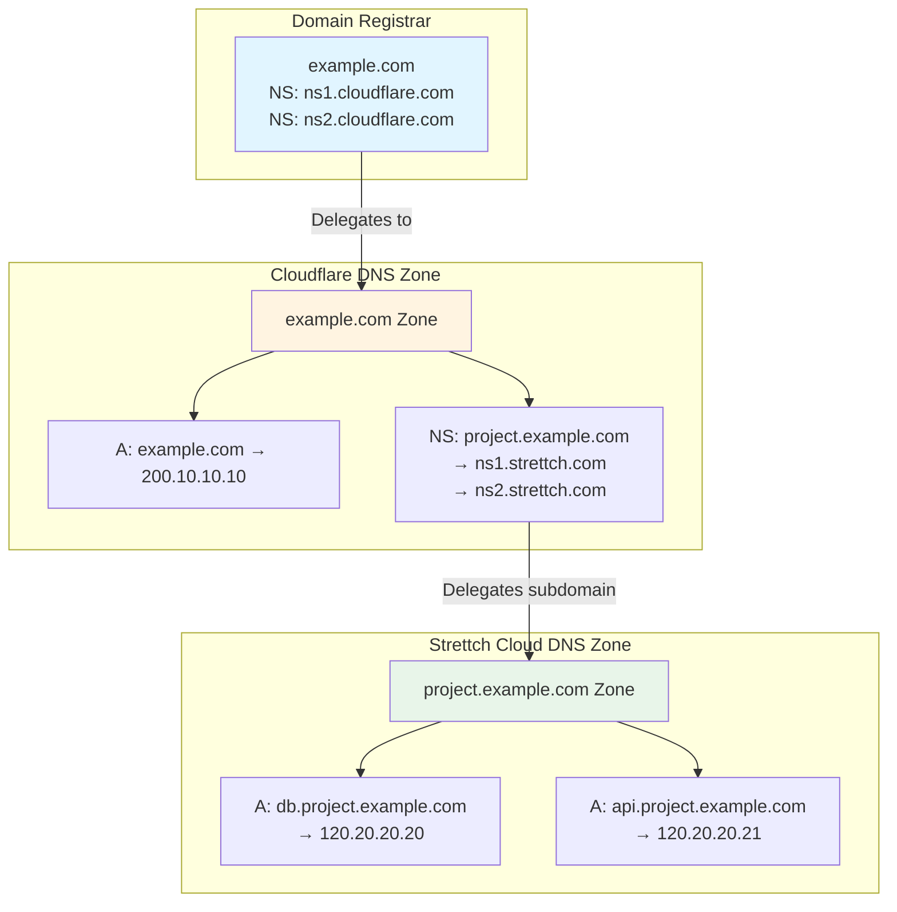
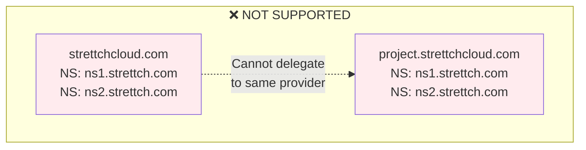
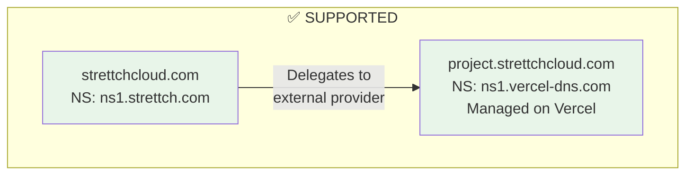
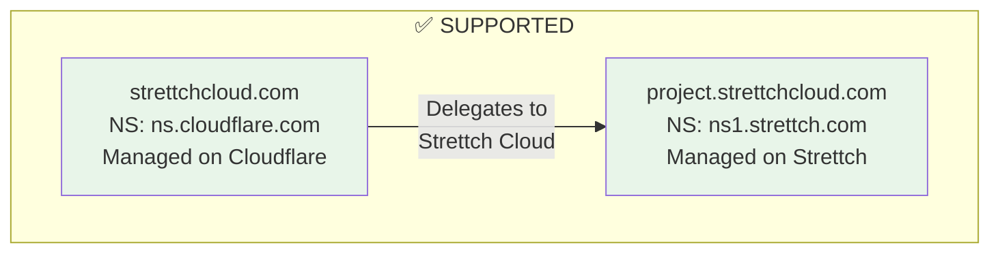

## Understanding Subdomain Zones

### What is a Subdomain Zone?

A subdomain zone is when you manage a subdomain (like `project.example.com`) as a completely separate DNS zone with its own nameservers, independent from the parent domain.

### How DNS Delegation Works

When a DNS query is made, it follows a delegation chain from your domain registrar through various nameservers to resolve the final IP address.

**Mermaid Diagram:**



**ASCII Diagram:**

```
┌─────────────────────────────────────────────────────────────┐
│ Domain Registrar (example.com)                              │
├─────────────────────────────────────────────────────────────┤
│ NS │ ns1.cloudflare.com ──────────┐                         │
│ NS │ ns2.cloudflare.com ──────────┤                         │
└───────────────────────────────────┼─────────────────────────┘
                                    │
                         ┌──────────▼──────────────────────────────────────────┐
                         │ Cloudflare DNS (example.com zone)                   │
                         ├─────────────────────────────────────────────────────┤
                         │ A  │ example.com         │ 200.10.10.10            │
                         │ A  │ example.com         │ 200.10.10.11            │
                         │ NS │ project.example.com │ ns1.strettch.com ───┐   │
                         │ NS │ project.example.com │ ns2.strettch.com ───┤   │
                         └─────────────────────────────────────────────────┼───┘
                                                                           │
                                      ┌────────────────────────────────────▼─────────────────┐
                                      │ Strettch Cloud DNS (project.example.com zone)        │
                                      ├──────────────────────────────────────────────────────┤
                                      │ A │ db.project.example.com  │ 120.20.20.20          │
                                      │ A │ api.project.example.com │ 120.20.20.21          │
                                      └──────────────────────────────────────────────────────┘

DNS Query Flow:
1. User queries db.project.example.com
2. Registrar returns: "Ask ns1.cloudflare.com"
3. Cloudflare returns: "Ask ns1.strettch.com for project.example.com"
4. Strettch Cloud returns: "120.20.20.20"
```

### Important Limitation

<Warning>
**What's NOT Supported**

You cannot create a subdomain as an independent DNS zone using **Strettch Cloud's nameservers** when the parent domain also uses Strettch Cloud's nameservers.

**Example of What's NOT Possible:**

**Mermaid Diagram:**


**ASCII Diagram:**
```
❌ NOT SUPPORTED:

strettchcloud.com
 ├─ Nameservers: ns1.strettch.com, ns2.strettch.com ✅
 └─ NS record: project → ns1.strettch.com, ns2.strettch.com ❌

    project.strettchcloud.com (as separate zone)
     └─ Nameservers: ns1.strettch.com, ns2.strettch.com ❌
```

In this scenario, you cannot manage `project.strettchcloud.com` as its own independent domain zone with isolated DNS records within Strettch Cloud.

**What IS Supported**

**Option 1: Delegate Subdomain to External DNS Providers**

**Mermaid Diagram:**


**ASCII Diagram:**
```
✅ SUPPORTED - Delegate to External Provider:

┌────────────────────────────────────────┐
│ Strettch Cloud DNS                     │
│ strettchcloud.com                      │
├────────────────────────────────────────┤
│ NS: ns1.strettch.com                   │
│ NS record: project → ns1.vercel-dns.com│──────┐
└────────────────────────────────────────┘      │
                                                 │
                        ┌────────────────────────▼───────────────┐
                        │ Vercel DNS                             │
                        │ project.strettchcloud.com              │
                        ├────────────────────────────────────────┤
                        │ NS: ns1.vercel-dns.com                 │
                        │ A: api.project → 76.76.21.21           │
                        └────────────────────────────────────────┘
```

**Option 2: Delegate Subdomain to Strettch Cloud from External Provider**

**Mermaid Diagram:**


**ASCII Diagram:**
```
✅ SUPPORTED - Delegate from External Provider:

┌────────────────────────────────────────┐
│ Cloudflare DNS                         │
│ strettchcloud.com                      │
├────────────────────────────────────────┤
│ NS: ns.cloudflare.com                  │
│ NS record: project → ns1.strettch.com  │──────┐
└────────────────────────────────────────┘      │
                                                 │
                        ┌────────────────────────▼───────────────┐
                        │ Strettch Cloud DNS                     │
                        │ project.strettchcloud.com              │
                        ├────────────────────────────────────────┤
                        │ NS: ns1.strettch.com                   │
                        │ A: api.project → 120.20.20.21          │
                        └────────────────────────────────────────┘
```

**What This Means for You:**

- ✅ You can add any subdomain records directly in your main domain (e.g., `api.project.strettchcloud.com`)
- ✅ You can delegate subdomains to external DNS providers like AWS Route 53, Vercel, or Cloudflare
- ✅ You can delegate subdomains TO Strettch Cloud when the parent domain is hosted elsewhere
- ❌ You cannot create subdomain zones that also use Strettch Cloud's nameservers when the parent is on Strettch Cloud
</Warning>
